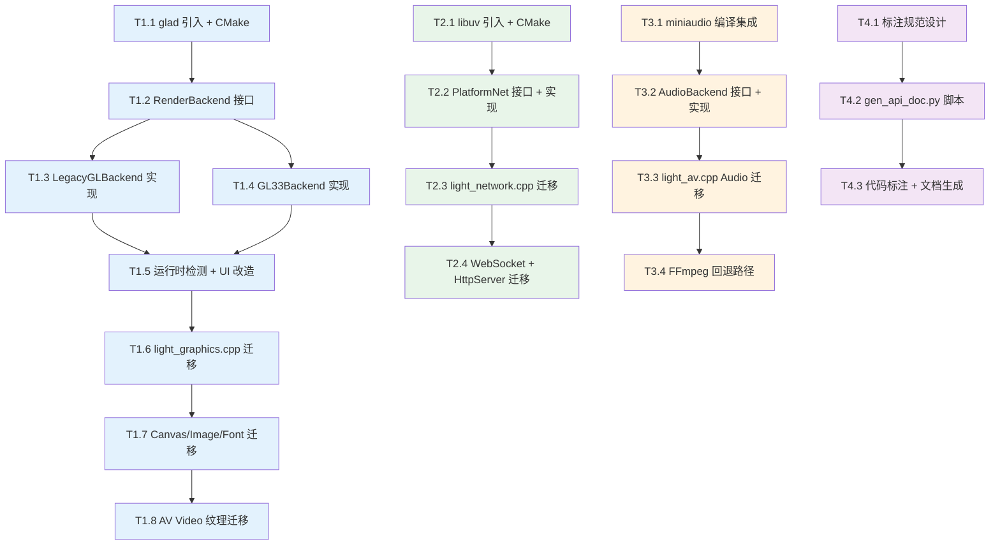

# TASK — ChocoLight 引擎 Phase 1 原子任务清单

> 创建日期: 2026-04-25 | 基于 DESIGN 文档拆分

---

## 任务依赖图



---

## T1: 图形管线升级 (8 个子任务)

### T1.1 glad 引入 + CMake 配置
- **输入契约**: 无前置依赖
- **输出契约**: `third_party/glad/` 目录含 `glad.h`, `glad.c`, `khrplatform.h`; CMake 可编译
- **实现约束**: 使用 [glad 在线生成器](https://glad.dav1d.de/) 生成 GL 3.3 Core Profile + 所有扩展
- **验收标准**: `cmake --build` 编译通过, glad 符号可链接
- **复杂度**: ⭐ 低
- **并行**: 可与 T2.1, T3.1, T4.1 并行

### T1.2 RenderBackend 抽象接口
- **输入契约**: T1.1 完成
- **输出契约**: `include/render_backend.h` — 完整接口定义 (见 DESIGN §3.1)
- **实现约束**: 纯虚类, 无实现代码; `RenderVertex` 结构体; `DrawMode` 枚举; 工厂函数声明
- **验收标准**: 头文件可被所有模块 include, 编译通过
- **复杂度**: ⭐ 低

### T1.3 LegacyGLBackend 实现
- **输入契约**: T1.2 完成
- **输出契约**: `src/render_legacy.cpp` — 用 GL 1.x API 实现 RenderBackend 所有方法
- **实现约束**:
  - `DrawArrays` → `glBegin/glEnd` + `glVertex3f/glTexCoord2f/glColor4f`
  - `PushMatrix/PopMatrix` → `glPushMatrix/glPopMatrix`
  - `Translate/Rotate/Scale` → `glTranslatef/glRotatef/glScalef`
  - 纹理/FBO → 现有 `wglGetProcAddress` 加载逻辑迁入
  - `DrawMode::Quads` → `GL_QUADS`
- **验收标准**: 单独编译通过; 可替代原 `light_graphics.cpp` 的所有 GL 调用
- **复杂度**: ⭐⭐ 中
- **并行**: 可与 T1.4 并行

### T1.4 GL33Backend 实现
- **输入契约**: T1.2 + T1.1(glad) 完成
- **输出契约**: `src/render_gl33.cpp` — 用 GL 3.3 Core API 实现 RenderBackend
- **实现约束**:
  - 共享 VAO + 动态 VBO (`glBufferSubData`)
  - 两个 shader program: textured + colored (内嵌 GLSL 330 字符串)
  - 自管理矩阵栈 (简单 4x4 矩阵运算, 不引入 glm)
  - `DrawMode::Quads` → 转换为 2 个三角形 (GL 3.3 Core 无 GL_QUADS)
  - `LoadOrtho` → 正交投影矩阵
- **验收标准**: glad 初始化成功后可绘制带纹理四边形
- **复杂度**: ⭐⭐⭐ 高

### T1.5 运行时检测 + UI 改造
- **输入契约**: T1.3 + T1.4 完成
- **输出契约**: `light_ui.cpp` 修改 — GLFW hints + 后端自动选择
- **实现约束**:
  - `Window.Open()` 中:
    1. 先尝试 `glfwWindowHint(GLFW_CONTEXT_VERSION_MAJOR, 3)` + Core Profile
    2. `glfwCreateWindow` 成功 → `gladLoadGLLoader` → `GL33Backend`
    3. 失败 → 重置 hints, 创建默认 context → `LegacyGLBackend`
  - 全局 `RenderBackend* g_render` 在窗口创建后初始化
  - 日志输出当前使用的后端名
- **验收标准**: 在 GL 3.3 和 GL 2.1 环境下都能创建窗口并初始化正确后端
- **复杂度**: ⭐⭐ 中

### T1.6 light_graphics.cpp 迁移
- **输入契约**: T1.5 完成 (g_render 可用)
- **输出契约**: `light_graphics.cpp` 中所有 12 个绘制函数改用 `g_render->` 调用
- **实现约束**:
  - 替换清单 (12 函数):
    - `l_Draw` → `g_render->BindTexture` + `DrawArrays(Quads, 4 verts)`
    - `l_DrawQuad` → 同上 (子区域 UV)
    - `l_DrawSprite` → 同上
    - `l_Print` → 字形批量提交 `DrawArrays(Quads, N*4 verts)`
    - `l_Line` → `DrawArrays(Lines, 2 verts)`
    - `l_Triangle` → `DrawArrays(Triangles/LineLoop, 3 verts)`
    - `l_Rectangle` → `DrawArrays(Quads/LineLoop, 4 verts)`
    - `l_RoundedRectangle` → `DrawArrays(TriangleFan/LineLoop, N verts)`
    - `l_Quad` → `DrawArrays(Quads/LineLoop, 4 verts)`
    - `l_Polygon` → `DrawArrays(TriangleFan/LineLoop, N verts)`
    - `l_Arc` → `DrawArrays(TriangleFan/LineStrip, N verts)`
    - `l_Circle` → `DrawArrays(TriangleFan/LineLoop, N verts)`
  - 替换变换: `glPushMatrix` → `g_render->PushMatrix()` 等
  - 替换颜色: `glColor4f` → `g_render->SetColor()`
  - 删除 `#include <GLFW/glfw3.h>` (GL 函数), 改用 `#include "render_backend.h"`
- **验收标准**: 所有 Lua Graphics 测试用例通过; 渲染结果与改造前视觉一致
- **复杂度**: ⭐⭐⭐ 高 (核心, 涉及 881 行文件)

### T1.7 Canvas/Image/Font 迁移
- **输入契约**: T1.6 完成
- **输出契约**: `light_graphics_canvas.cpp`, `light_graphics_image.cpp`, `light_graphics_font.cpp` 改用 `g_render->`
- **实现约束**:
  - Canvas: `LoadFBOFunctions()` 删除, FBO 操作 → `g_render->CreateFBO/DeleteFBO/BindFBO`
  - Image: `glGenTextures/glTexImage2D` → `g_render->CreateTexture`
  - Font: 字形图集更新 → `g_render->UpdateTexture`
  - CanvasContext 保持兼容 (fbo, texture, depthRB, w, h)
- **验收标准**: Canvas 离屏渲染 + 绘制到屏幕正常; 字体渲染正常; 图片加载正常
- **复杂度**: ⭐⭐ 中

### T1.8 AV Video 纹理迁移
- **输入契约**: T1.7 完成
- **输出契约**: `light_av.cpp` Video 部分的 GL 纹理操作改用 `g_render->`
- **实现约束**: Video 帧更新: `glTexImage2D` → `g_render->UpdateTexture`
- **验收标准**: 视频播放帧渲染正常
- **复杂度**: ⭐ 低

---

## T2: 跨平台网络 (4 个子任务)

### T2.1 libuv 引入 + CMake
- **输入契约**: 无前置依赖
- **输出契约**: `third_party/libuv/` 子目录; CMake 可编译链接
- **实现约束**: 
  - 从 [libuv/libuv](https://github.com/libuv/libuv) 获取稳定版
  - CMake `add_subdirectory(third_party/libuv)` 或静态库
  - Windows: 链接 ws2_32, iphlpapi, userenv
  - Linux/macOS: 链接 pthread
- **验收标准**: `cmake --build` 编译通过, libuv 符号可链接
- **复杂度**: ⭐ 低
- **并行**: 可与 T1.1, T3.1, T4.1 并行

### T2.2 PlatformNet 接口 + libuv 实现
- **输入契约**: T2.1 完成
- **输出契约**: `include/platform_net.h` + `src/platform_net.cpp`
- **实现约束**:
  - TCP 客户端: connect, write, read (异步)
  - TCP 服务器: bind, listen, accept
  - DNS 解析: `uv_getaddrinfo` (替代手动 `getaddrinfo`)
  - `Poll()`: 调用 `uv_run(loop, UV_RUN_NOWAIT)`, 每帧在 UI.Resume 中调用
- **验收标准**: 独立测试: TCP echo client/server 通信成功
- **复杂度**: ⭐⭐⭐ 高

### T2.3 light_network.cpp HTTP 迁移
- **输入契约**: T2.2 完成
- **输出契约**: `light_network.cpp` 中 Http 客户端改用 PlatformNet
- **实现约束**:
  - `HttpContext` 替换: `SOCKET fd` → `NetHandle*`
  - `l_Http_Open` → `PlatformNet::TcpConnect`
  - `l_Http_SendRequest` → `PlatformNet::TcpWrite`
  - 接收: `TcpStartRead` 回调 → `ParseAndDispatchHttp`
  - 删除 `#include <winsock2.h>`, 删除 `WSAStartup/WSACleanup`
  - 保留 HTTP 解析逻辑 (ParseAndDispatchHttp) 不变
- **验收标准**: HTTP GET 到公网服务器成功; 在 Windows 和 Linux 上测试通过
- **复杂度**: ⭐⭐⭐ 高

### T2.4 WebSocket + HttpServer 迁移
- **输入契约**: T2.3 完成
- **输出契约**: WebSocket 和 HttpServer 功能改用 PlatformNet
- **实现约束**:
  - WebSocket: Upgrade 握手 + 帧收发逻辑保持不变, 仅底层 send/recv 替换
  - HttpServer: `bind/listen/accept` → `PlatformNet::TcpBind/Listen/Accept`
  - Web 框架 (纯 Lua) 不需修改
- **验收标准**: WebSocket 聊天示例正常; HttpServer 路由响应正常
- **复杂度**: ⭐⭐ 中

---

## T3: 音频系统 (4 个子任务)

### T3.1 miniaudio 编译集成
- **输入契约**: 无前置依赖 (miniaudio.h 已在 third_party)
- **输出契约**: miniaudio 可编译; 新增 `third_party/miniaudio_impl.c` (含 `#define MINIAUDIO_IMPLEMENTATION`)
- **实现约束**: 
  - 单头文件库, 需一个 .c 文件定义实现
  - CMake 添加编译
  - 确保 Windows/Linux/macOS 都能编译
- **验收标准**: 编译通过, `ma_engine_init` 可调用
- **复杂度**: ⭐ 低
- **并行**: 可与 T1.1, T2.1, T4.1 并行

### T3.2 AudioBackend 接口 + miniaudio 实现
- **输入契约**: T3.1 完成
- **输出契约**: `include/light_audio_backend.h` + `src/light_audio_backend.cpp`
- **实现约束**:
  - `ma_engine` 全局实例 (自动混音)
  - `LoadFile` → `ma_sound_init_from_file`
  - `LoadPCM` → `ma_audio_buffer` + `ma_sound_init_from_data_source`
  - `Play/Pause/Stop` → `ma_sound_start/stop`
  - `SetVolume` → `ma_sound_set_volume`
  - `Free` → `ma_sound_uninit`
- **验收标准**: 独立测试: 播放 MP3/WAV 文件, 音量调节, 暂停/继续
- **复杂度**: ⭐⭐ 中

### T3.3 light_av.cpp Audio 迁移
- **输入契约**: T3.2 完成
- **输出契约**: `light_av.cpp` Audio 部分使用 AudioBackend
- **实现约束**:
  - `l_Audio_Call` (构造): 先尝试 `AudioBackend::LoadFile(path)`
  - `l_Audio_Play`: → `AudioBackend::Play`
  - `l_Audio_Pause`: → `AudioBackend::Pause`
  - `l_Audio_Stop`: → `AudioBackend::Stop`
  - `AVContext` 新增 `AudioHandle*` 字段
  - 删除 `#include <mmsystem.h>`, 删除 `PlaySound` 调用
  - 保留 FFmpeg 加载逻辑 (供 Video 和回退使用)
- **验收标准**: MP3/WAV 非阻塞播放; Lua API 行为不变
- **复杂度**: ⭐⭐ 中

### T3.4 FFmpeg 回退路径
- **输入契约**: T3.3 完成
- **输出契约**: miniaudio 解码失败时自动回退 FFmpeg
- **实现约束**:
  - `l_Audio_Call` 中: `LoadFile` 返回 null → FFmpeg 解码 → `LoadPCM`
  - 日志标注当前使用的解码路径
  - AudioData 模块保持 FFmpeg 解码 (用于获取 PCM 元数据)
- **验收标准**: 播放 miniaudio 不支持的格式 (如 AAC/WMA) 时自动回退
- **复杂度**: ⭐⭐ 中

---

## T4: API 文档 (3 个子任务)

### T4.1 标注规范设计
- **输入契约**: 无前置依赖
- **输出契约**: `docs/引擎升级/API_ANNOTATION_SPEC.md` — 标注格式规范
- **实现约束**: 定义 C++ 注释中的标注格式, 例如:
  ```cpp
  /// @lua_api Light.Graphics.Draw
  /// @brief 绘制纹理/图像到屏幕
  /// @param drawable Image|Canvas 可绘制对象
  /// @param x number 水平位置
  /// @param y number 垂直位置
  /// @param z number? 深度 (默认 0)
  /// @return void
  /// @example
  /// local img = Light(Light.Graphics.Image):New("hero.png")
  /// Light.Graphics.Draw(img, 100, 200)
  ```
- **验收标准**: 规范文档完整, 覆盖所有标注字段
- **复杂度**: ⭐ 低
- **并行**: 可与 T1.1, T2.1, T3.1 并行

### T4.2 gen_api_doc.py 脚本
- **输入契约**: T4.1 完成
- **输出契约**: `tools/gen_api_doc.py` — 可执行脚本
- **实现约束**:
  - 扫描 `ChocoLight/src/*.cpp`
  - 解析 `@lua_api` 注释块
  - 按模块分组生成 Markdown 文件到 `docs/api/`
  - 支持: 函数签名、参数表、返回值、示例代码
- **验收标准**: `python tools/gen_api_doc.py` 生成完整 API 文档; 无语法错误
- **复杂度**: ⭐⭐ 中

### T4.3 代码标注 + 文档生成
- **输入契约**: T4.2 完成
- **输出契约**: 所有公开 Lua API 函数添加 `@lua_api` 标注; `docs/api/` 下生成完整文档
- **实现约束**:
  - 需标注的模块: Graphics(24), Canvas(2), Image(6), ImageData(7), Font(2), AV(3), Audio(3), AudioData(7), Video(8), DB(2), SQLite(7), Network(1), Http(8), HttpServer(4), Record(~12), Plugins(~6)
  - 约 ~100 个函数需要标注
- **验收标准**: 文档覆盖率 100%; 每个函数有签名+说明; GitHub 可直接浏览
- **复杂度**: ⭐⭐ 中 (工作量大但技术简单)

---

## 执行顺序建议

### 第一批 (并行启动, 无依赖)
- **T1.1** glad 引入
- **T2.1** libuv 引入
- **T3.1** miniaudio 集成
- **T4.1** 标注规范

### 第二批 (接口设计)
- **T1.2** RenderBackend 接口
- **T2.2** PlatformNet 实现
- **T3.2** AudioBackend 实现
- **T4.2** 文档脚本

### 第三批 (后端实现)
- **T1.3** LegacyGL 后端 ‖ **T1.4** GL33 后端

### 第四批 (集成迁移)
- **T1.5** 运行时检测
- **T1.6** Graphics 迁移
- **T1.7** Canvas/Image/Font 迁移
- **T1.8** AV Video 迁移
- **T2.3** HTTP 迁移 → **T2.4** WS/Server 迁移
- **T3.3** Audio 迁移 → **T3.4** FFmpeg 回退
- **T4.3** 代码标注

---

## 工作量估计

| 任务组 | 子任务数 | 新增代码 | 修改代码 | 预估工时 |
|--------|---------|---------|---------|---------|
| T1 图形 | 8 | ~800 行 | ~900 行 | 5-7 天 |
| T2 网络 | 4 | ~400 行 | ~800 行 | 3-4 天 |
| T3 音频 | 4 | ~350 行 | ~300 行 | 2-3 天 |
| T4 文档 | 3 | ~200 行脚本 + ~100 标注 | — | 2-3 天 |
| **总计** | **19** | **~1,750 行** | **~2,000 行** | **12-17 天** |
