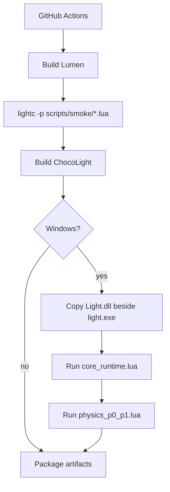

# 运行时 Smoke CI 设计

## 架构

## 组件

- `scripts/smoke/core_runtime.lua`: 验证 Windows runtime 下新旧核心模块都已预加载。
- `scripts/smoke/physics_p0_p1.lua`: 继续验证 Physics World/Body/Fixture/Contact 基础行为。
- `lumen-master/src/light/light.cpp`: Windows runtime 的 `Light.dll` 模块预加载表。
- `.github/workflows/build-templates.yml`: CI smoke 调度入口。

## 异常处理

任一 smoke 脚本返回非 0 时，当前 job 失败。Linux/macOS 仅做语法检查，避免把尚未实现的 `libLight` 自动加载能力混入本阶段。
