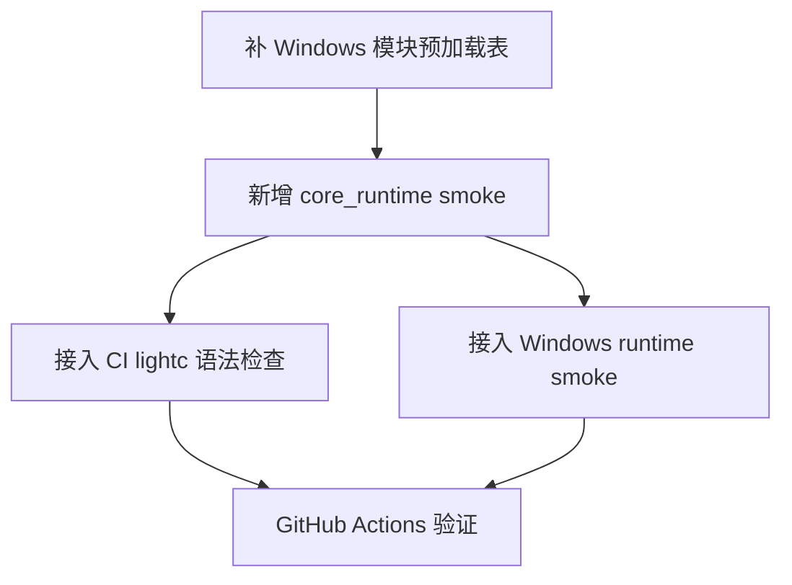

# 运行时 Smoke CI 任务

## 任务依赖图

## T1: 补 Windows 模块预加载表

**输入**: `light.h` 已导出的 `luaopen_Light_*` 符号。  
**输出**: `light.cpp` 的 `g_lightModules` 包含 Phase2/Phase3 新模块。  
**验收**: Windows `light.exe` 启动后 `Light.Physics` 等模块存在。

## T2: 新增 core_runtime smoke

**输入**: Windows runtime 自动加载 `Light.dll`。  
**输出**: `scripts/smoke/core_runtime.lua`。  
**验收**: `light.exe scripts/smoke/core_runtime.lua` 返回 0。

## T3: 接入 CI lightc 语法检查

**输入**: Lumen `lightc` 已构建。  
**输出**: Windows/Linux/macOS workflow 执行 `lightc -p scripts/smoke/*.lua`。  
**验收**: 任一 smoke 语法错误会让 job 失败。

## T4: 接入 Windows runtime smoke

**输入**: Windows 已构建 `Light.dll` 与 `light.exe`。  
**输出**: workflow 运行 `core_runtime.lua` 和 `physics_p0_p1.lua`。  
**验收**: 任一运行时断言失败会让 Windows job 失败。

## T5: GitHub Actions 验证

**输入**: 变更推送到 `origin`。  
**输出**: GitHub Actions 全平台构建结果。  
**验收**: Windows/Linux/macOS/Android/iOS/Web 成功。
